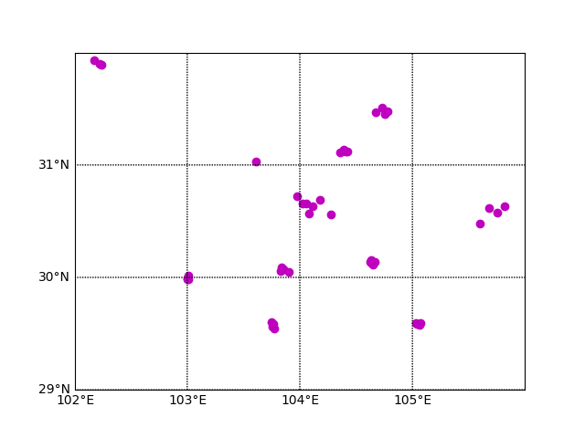

# pollution-trajectory
目的是：得到污染物向中心区域(成都市区)传播的路径
采用的判定方法：
1) 提取出每个站点污染物的上升趋势
2) 计算不同站点间上升趋势的相关性（用相关系数衡量）
3) 若两个站点间污染物上升趋势间的相关性很高，则判断是否两个站点间的上升符合风的传播路径。
4) 判断传播路径是否向中心区域的方向。
5) 判断是否抵达中心区域。

## Requirements

- [matplotlib]
- [Basemap]


## Running

```bash
sh run.sh
```

## Plot
```bash
cd utils
python plot.py
```

## Result
See [trajectory_result](results/trajectory_result.pickle).


## Parameter
- time_step: 污染持续上升时间
- pollution_increase: 污染物上升值
- pollution_thres: 污染物警戒阈值
- min_pollution_increase: 最小污染物上升值
- min_pollution_thres: 最小污染物警戒阈值
- time_lag: 两个站点间污染发生的最大时间跨度


## 国控站点分布   
  